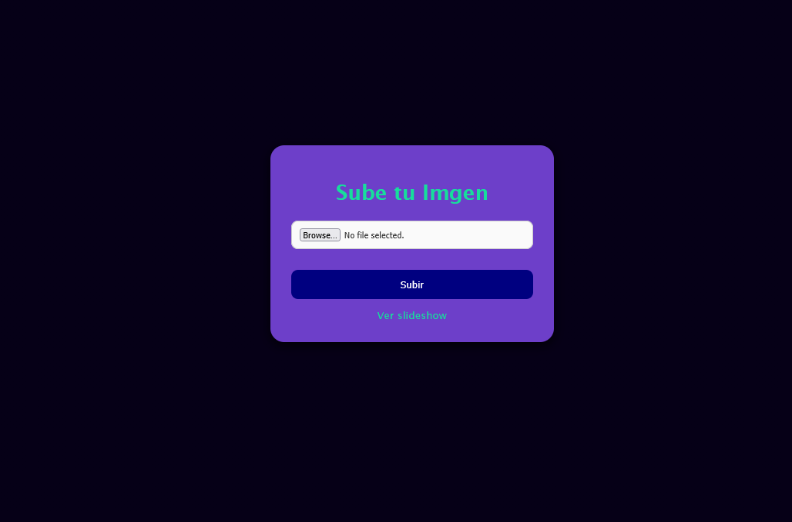

# 📸 Fotos para el Evento

¡Bienvenido! Este es un proyecto de aplicación web diseñado para que los invitados de un evento, como un cumpleaños o una fiesta, puedan compartir sus fotos fácilmente y verlas en una presentación en tiempo real.

## 🚀 ¿Cómo funciona?

1.  El anfitrión inicia la aplicación en una computadora o dispositivo conectado a la misma red Wi-Fi que los invitados.
2.  La aplicación genera un **código QR** que se muestra en la pantalla principal.
3.  Los invitados escanean el código QR con sus teléfonos, lo que los redirige a una página web local para subir sus fotos.
4.  Una vez subidas, las fotos aparecen automáticamente en un **slideshow** que se puede proyectar en una pantalla grande para que todos las vean.

---

## ✨ Características Principales

* **Generación de QR Automática:** Al iniciar, la aplicación genera un código QR con la dirección IP local para un acceso rápido y sencillo.


* **Subida de Fotos Simplificada:** Los usuarios pueden subir fotos de manera fácil y rápida desde sus dispositivos móviles.



* **Slideshow en Tiempo Real:** Las fotos se actualizan en el slideshow automáticamente, sin necesidad de recargar la página.


* **Gestión Segura de Archivos:** Cada foto subida recibe un nombre único (**UUID**) para evitar errores causados por espacios o caracteres especiales en los nombres de los archivos.

---

## 🛠️ Requisitos del Sistema

* **Python 3.11** (o superior)
* **Pip** (gestor de paquetes de Python)
* **Uv** (Opcional pero recomendado, tu vida será más fácil si lo usas)

## 💻 Instalación y Uso

Sigue estos pasos para poner a funcionar el proyecto:

- **Clona este repositorio** (o descarga los archivos si los tienes en una carpeta local).

- **Instala las dependencias necesarias** usando `pip` o `uv`. Abre una terminal en la carpeta del proyecto y ejecuta el siguiente comando:

#### Con Pyhton y Pip

1. **Genera entorno virtual con python**

```bash
$ python -m venv .venv
```

2. **Activa entorno**

```bash
source .venv/bin/activate
```

3. **Instala las dependencias con pip**

```bash
pip install -e .
```

4. **Ejecuta la aplicacion, una vez ejecutada tu navegador predeterminado se abrira en la ruta del Qr generado**

```bash
./.venv/bin/python3 app.py
```

#### Con UV

1. **Genera el entorno virtual e instala las dependencias:**

```bash
uv sync
```

2. **Ejecuta la aplicacion, una vez ejecutada tu navegador predeterminado se abrira en la ruta del Qr generado**

```bash
./.venv/bin/python3 app.py
```

---

## 📁 Estructura del Proyecto

*   `app.py`: El cerebro de la aplicación, un servidor Flask que maneja las rutas y la lógica principal.
*   `templates/`: Contiene las plantillas HTML:
    *   `upload.html`: La plantilla HTML para la página de subida de fotos.
    *   `display.html`: La plantilla HTML para el slideshow que muestra las imágenes.
    *   `qr.html`: La plantilla HTML que muestra el código QR para el evento.
*   `static/`: Contiene los archivos estáticos como las imágenes subidas (`uploads`).
*   `uploads/`: Directorio donde se guardan las imágenes subidas.
*   `scripts/`: Contiene scripts auxiliares.

---

## 🆕 Novedades y Mejoras (Última Actualización: 17/10/2025)

Se han implementado mejoras significativas y correcciones de errores para optimizar la experiencia del usuario y la estabilidad de la aplicación.

### ✅ **Problemas Críticos Resueltos:**

1.  **CSS Container Desalineado y Rendimiento (display.html):**
    *   El contenedor del slideshow ahora se centra correctamente.
    *   Se optimizó el rendimiento del gradiente de fondo en navegadores como Mozilla.
    *   Reducción de partículas de fondo para mejor performance.

2.  **Loop Crítico del Botón de Cámara (upload.html):**
    *   Se eliminó el bucle infinito al interactuar con el botón de la cámara y la galería.
    *   Implementación de control de estado y limpieza de streams para una gestión robusta de la cámara.

3.  **Manejo de Cargas Masivas (+800 imágenes):**
    *   La aplicación ahora maneja cargas de más de 800 imágenes simultáneas de manera controlada.
    *   Implementación de límites de batch, procesamiento concurrente y manejo de errores mejorado.

### ✅ **Mejoras Generales Implementadas:**

1.  **Tema Oscuro y Fuentes Monoespaciadas:**
    *   Interfaz de usuario actualizada con un tema oscuro consistente y fuentes monoespaciadas (`Fira Code`).
    *   Efectos de glassmorphism y gradientes modernos para una estética mejorada.

2.  **Optimizaciones de Rendimiento:**
    *   Soporte añadido para formatos de imagen `HEIC` y `HEIF`.
    *   Logging mejorado y un nuevo endpoint `/api/status` para health checks.

3.  **Manejo Robusto de Errores:**
    *   Implementación de `try-catch` en funciones críticas y `error handlers` HTTP (413, 500).
    *   Validación de archivos más estricta y logs con `traceback` completo.

---

## 🚀 Próximos Pasos Sugeridos

1.  **Implementar los archivos corregidos:** Reemplazar los archivos originales con las versiones `_fixed` (luego renombrarlos a sus nombres originales).
2.  **Probar cada issue reportado** para confirmar las correcciones.
3.  **Realizar testing de carga** con 700-900 imágenes.
4.  **Considerar asignación de nombres de dominio amigables.**