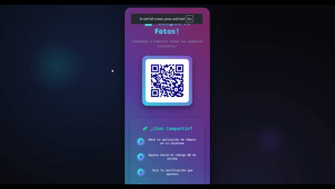
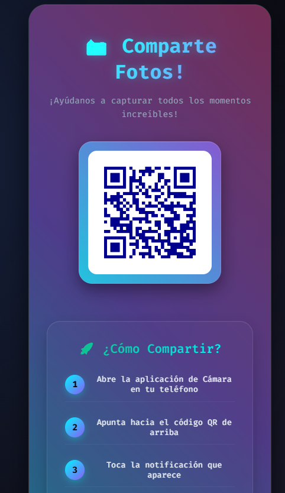
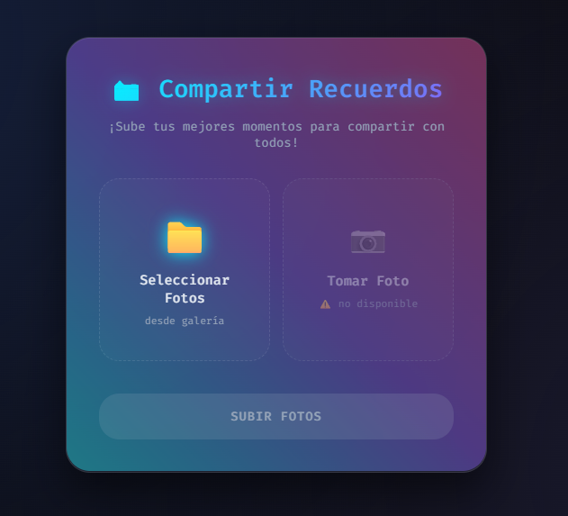

# 📸 Digital Memoirs - Event Photo Sharing

¡Bienvenido! Digital Memoirs es una aplicación web diseñada para que los invitados de eventos (cumpleaños, bodas, fiestas) puedan compartir sus fotos fácilmente mediante WiFi y verlas en un slideshow en tiempo real proyectado en pantalla grande.

---

## 🚀 ¿Cómo funciona?

### En el Evento

1.  **El host enchufa el Raspberry Pi** → Todo se inicia automáticamente
2.  **La aplicación genera códigos QR** que se muestran en la pantalla
3.  **Los invitados escanean el QR WiFi** → Se conectan automáticamente
4.  **Los invitados escanean el QR URL** → Abren la página de upload
5.  **Suben fotos** desde su galería
6.  **Las fotos aparecen automáticamente** en el slideshow proyectado

### Sistema de 2 QR Codes

- **QR 1 (WiFi)**: Conexión automática a la red "MomentoMarco"
- **QR 2 (URL)**: Abre la página de upload en el navegador

**No requiere intervención manual** → Plug & Play para eventos

---

## ✨ Características Principales

### 🎯 Para el Host

* **Auto-inicio con systemd**: Flask inicia automáticamente al encender el Raspberry Pi
* **Navegador en modo kiosk**: Chromium se abre automáticamente en pantalla completa mostrando el slideshow
* **Sin contraseñas del keyring**: Configuración optimizada para no solicitar contraseñas
* **Gestión automática de QR**: Genera 2 QR codes (WiFi + URL) al iniciar

### 📱 Para los Invitados

* **Conexión WiFi automática**: Escanean QR → Se conectan sin configuración manual
* **Subida simple de fotos**: Interfaz intuitiva con drag & drop
* **Soporte multi-archivo**: Hasta 800 fotos por batch
* **Compatibilidad total**: Funciona en iOS, Android, Windows

### 🖥️ Slideshow

* **Actualización en tiempo real**: Las fotos aparecen automáticamente sin recargar
* **Rotación 90°**: Optimizado para proyección landscape
* **Dark theme glassmorphism**: Diseño moderno con efectos visuales
* **Performance optimizado**: Funciona suavemente en Raspberry Pi

### 🔒 Seguridad y Estabilidad

* **UUID file naming**: Nombres únicos previenen conflictos
* **Batch limit validation**: Protección contra sobrecarga de memoria
* **ThreadPoolExecutor**: Procesamiento concurrente de uploads
* **Watchdog monitoring**: Detección automática de nuevas fotos

---

## 📸 Screenshots

### QR Display





### Upload Interface




### Slideshow Display


---

## 🛠️ Requisitos del Sistema

### Para Desarrollo

* **Python**: >= 3.11
* **Pip**: Gestor de paquetes de Python
* **uv**: Recomendado (instalación más rápida y gestión de dependencias)

### Para Producción (Raspberry Pi)

* **Hardware**: Raspberry Pi 3/4/5
* **OS**: Raspberry Pi OS Bookworm (Debian 12)
* **Python**: >= 3.11 (pre-instalado)
* **uv**: Para gestión de dependencias
* **Acceso**: Pantalla, teclado, proyector/TV

---

## 💻 Instalación

### Instalación para Desarrollo (Local)

#### Con uv (Recomendado)

```bash
# 1. Clonar repositorio
git clone <repo-url>
cd digital-memoirs

# 2. Instalar uv si no lo tienes
curl -LsSf https://astral.sh/uv/install.sh | sh

# 3. Sincronizar dependencias
uv sync

# 4. Ejecutar aplicación
uv run app.py
```

El navegador se abrirá automáticamente en `http://localhost:5000/display`.

#### Con pip y venv

```bash
# 1. Crear entorno virtual
python -m venv .venv

# 2. Activar entorno
source .venv/bin/activate  # Linux/Mac
# .venv\Scripts\activate  # Windows

# 3. Instalar dependencias
pip install -e .

# 4. Ejecutar aplicación
python app.py
```

---

### Instalación para Producción (Raspberry Pi)

#### 🎯 Setup Completo (Recomendado para Eventos)

```bash
# 1. Clonar repositorio en el Pi
cd /home/pi/Downloads/repos
git clone <repo-url> digital-memoirs
cd digital-memoirs

# 2. Instalar uv
curl -LsSf https://astral.sh/uv/install.sh | sh
source ~/.bashrc

# 3. Sincronizar dependencias
uv sync

# 4. Instalar servicio systemd (Flask auto-inicio)
cd scripts
chmod +x install_service.sh
./install_service.sh
# Selecciona: Opción 1 (con delay 180s) para máxima confiabilidad

# 5. Instalar autostart del navegador (Chromium en kiosk)
chmod +x setup_autostart.sh
./setup_autostart.sh
# Responde 'Y' para probar inmediatamente

# 6. Reiniciar y probar
sudo reboot
# Después del reboot:
# - Haz login en el escritorio (GUI)
# - Espera 3-5 minutos
# - Todo se abrirá automáticamente
```

**Ver documentación completa**: `scripts/README_SCRIPTS.md`

---

### 🚀 Inicio Rápido (Día del Evento)

Una vez instalado, el día del evento solo necesitas:

```
1. 🔌 Enchufa el Raspberry Pi
2. 🖥️ Haz login en el escritorio (usuario 'pi')
3. ⏳ Espera 3-5 minutos
4. ✅ TODO funciona automáticamente:
   - Flask corriendo en background
   - Chromium mostrando slideshow en pantalla completa
   - QR codes generados
   - Listo para proyectar
```

**No requiere abrir terminal ni ejecutar comandos.**

---

## 📁 Estructura del Proyecto

```bash
digital-memoirs/
├── app.py                      # Flask application (backend principal)
├── pyproject.toml              # Dependencias y configuración del proyecto
├── uv.lock                     # Lock file de dependencias
│
├── templates/                  # Templates HTML (Jinja2)
│   ├── display.html            # Slideshow principal
│   ├── qr.html                 # Página de QR codes
│   └── upload.html             # Interfaz de upload
│
├── static/                     # Archivos estáticos (auto-generados)
│   └── qr_code.png             # QR code generado
│
├── uploads/                    # Fotos subidas por usuarios (UUID-named)
│   └── [uuid].{jpg,png,gif,webp,heic}
│
├── scripts/                    # Scripts de deployment y testing
│   ├── install_service.sh      # Instalador del servicio systemd
│   ├── setup_autostart.sh      # Instalador del autostart del navegador
│   ├── autostart_browser.sh    # Script de autostart
│   ├── digital-memoirs-FIXED.service
│   ├── digital-memoirs-NO-DELAY.service
│   ├── digital-memoirs-autostart.desktop
│   │
│   ├── testing/                # Herramientas de testing y diagnóstico
│   │   ├── diagnostics/        # Diagnóstico de servicio systemd
│   │   └── network/            # Diagnóstico de red
│   │
│   └── reference/              # Código de referencia (archivado)
│       ├── hotfixes/           # Versiones anteriores con fixes
│       ├── templates/          # Templates antiguos/experimentales
│       └── services/           # Servicios systemd obsoletos
│
├── .github/
│   └── CLAUDE.md               # Documentación técnica completa
│
├── assets/                     # Assets para README (screenshots, GIFs)
├── README.md                   # Este archivo
├── CHANGELOG.md                # Historial de cambios
└── TODO.md                     # Issues y tareas pendientes
```

### Archivos Clave

| Archivo | Propósito |
|---------|-----------|
| `app.py` | Backend Flask con todas las rutas y lógica |
| `templates/*.html` | Frontend con dark theme glassmorphism |
| `scripts/install_service.sh` | Setup de servicio systemd |
| `scripts/setup_autostart.sh` | Setup de autostart del navegador |
| `scripts/testing/` | Herramientas de diagnóstico |
| `.github/CLAUDE.md` | Documentación técnica detallada |
| `CHANGELOG.md` | Historial de versiones y cambios |

---

## 🔧 Troubleshooting

### El servicio no inicia después del reboot

```bash
# Ver estado
sudo systemctl status digital-memoirs

# Ver logs
sudo journalctl -u digital-memoirs -n 50

# Ejecutar diagnóstico completo
cd scripts/testing/diagnostics
./diagnose_service.sh > report.txt
```

### El navegador no se abre automáticamente

```bash
# Verificar autostart
ls ~/.config/autostart/digital-memoirs-autostart.desktop

# Ver logs del autostart
tail -f ~/.digital-memoirs-autostart.log

# Probar manualmente
cd /home/pi/Downloads/repos/digital-memoirs/scripts
./autostart_browser.sh
```

### Los invitados no pueden conectarse al WiFi

```bash
# Verificar wlan0
ip addr show wlan0

# Verificar dnsmasq
sudo systemctl status dnsmasq

# Ejecutar diagnóstico de red
cd scripts/testing/network
python3 network_diagnostic.py
```

---

## 📚 Documentación Adicional

- **Setup Detallado**: `scripts/README_SCRIPTS.md`
- **Solución de Timeout**: `scripts/SOLUCION_TIMEOUT.md`
- **Autostart del Navegador**: `scripts/AUTOSTART_BROWSER.md`
- **Documentación Técnica**: `.github/CLAUDE.md`
- **Historial de Cambios**: `CHANGELOG.md`

---

## 🤝 Contribuir

Contribuciones son bienvenidas. Por favor:

1. Fork el repositorio
2. Crea un branch para tu feature (`git checkout -b feature/AmazingFeature`)
3. Commit tus cambios (`git commit -m 'Add some AmazingFeature'`)
4. Push al branch (`git push origin feature/AmazingFeature`)
5. Abre un Pull Request

---

## 📝 Licencia

Este proyecto es de código abierto.

---

## 🙏 Agradecimientos

- Flask framework
- uv package manager
- Raspberry Pi community
- Todos los que han contribuido con feedback de eventos reales

---

**Versión actual**: 0.3.0
**Última actualización**: 2025-10-28
